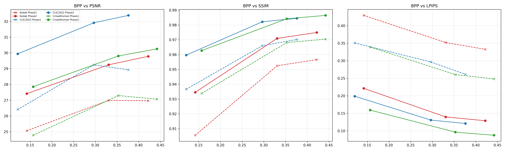
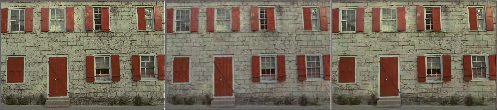
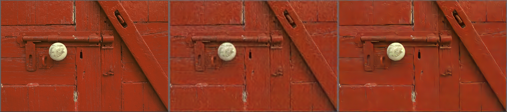
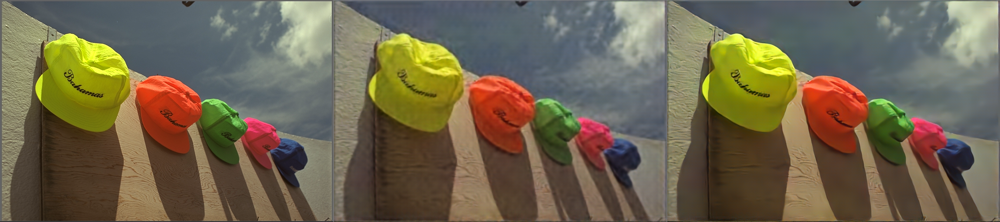
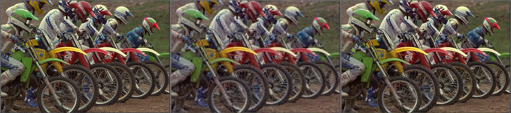

# 🚀 MultiScale-StyleGAN Image Compression

**Official PyTorch implementation of a Multi-Scale VAE architecture utilizing a StyleGAN-based decoder for high-fidelity, photorealistic image compression.**

---

## 🧠 Model Architecture & Visualization
We utilize a multi-scale encoder to capture features at different resolutions. The decoder leverages **StyleGAN** blocks to reconstruct high-frequency details from the quantized latent space.

### Layer-wise Feature Analysis ("X-Ray")
The figure below visualizes the internal feature maps. You can see how the network encodes the image, compresses it into the latent bottleneck, and hallucinates details back in the decoder.


---

## 📈 Quantitative Results
Our model outperforms standard baselines in perceptual quality (LPIPS/FID) while maintaining competitive PSNR.



### Detailed Metrics
You can view the detailed CSV results [here](assets/results.csv).
---
## 📂 Project Structure
- **`train_base.py`**: Training script (Encoder + Quantizer + StyleGAN Decoder).
- **`train_enhancer.py`**: Refinement Network training script.
- **`evaluate_metrics.py`**: Evaluation script (Generates PSNR/SSIM/LPIPS).
- **`visualize_layers.py`**: Visualization script (Generates the X-Ray image above).
## ⚙️ How to Train (Bitrate Control)

To train models for different bitrates (0.1, 0.3, 0.5 bpp), open `train_base.py` and modify the lambda value:

```python
# In train_base.py:
lmbda = 0.0018  # Target ~0.1 bpp
# lmbda = 0.0130 # Target ~0.3 bpp
# lmbda = 0.0250 # Target ~0.5 bpp

## ⚙️ How to Run
1. **Install Requirements:** `pip install -r requirements.txt`
2. **Visualize Layers:** `python visualize_layers.py`
3. **Get Metrics:** `python evaluate_metrics.py`
---

## 🖼️ Qualitative Examples (Kodak Subset)
Below are visual comparisons at **0.1 bpp** (High Compression). The model successfully reconstructs high-frequency textures (like the wood grain and bricks) that are typically lost by standard codecs.

### Sample 1: Window & Shutters


### Sample 2: Red Door


### Sample 3: Hats (Text & Texture)


### Sample 4: Face & Skin Tone


### Sample 5: Motorcycles (Metallic Reflections)

